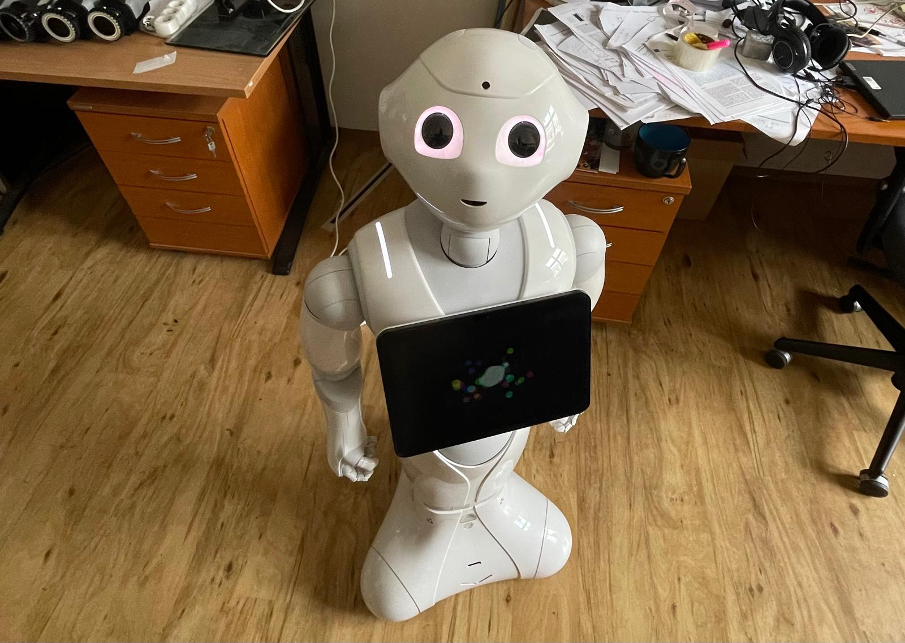

# Pepper — The FEE CTU Receptionist



This project turns Pepper into a spoken receptionist assistant using:
1) a **Python 3 LiveKit/OpenAI realtime agent** (`voice-agent/`),
2) a **web playground UI** for creating sessions and testing dialogue,
3) an optional **Weaviate-backed retrieval tool** for FEL documents,
4) optional **Pepper audio playback bridge** (Python 2.7 receiver + Python 3 listener).

Current setup does **not** use Letta.

## Current Architecture

1. **Voice agent (primary runtime, Python 3)**  
   File: `voice-agent/src/agent.py`  
   Runs the LiveKit agent session and OpenAI realtime model.

2. **RAG tooling (optional)**  
   Files: `voice-agent/src/tools.py`, `voice-agent/src/utils.py`  
   Exposes `query_search` over Weaviate for grounded answers.

3. **Playground frontend**  
   Folder: `web/agents-playground/`  
   URL: `http://localhost:3000/`  
   Creates room/token snapshots used by the listener bridge.

4. **LiveKit -> Pepper audio bridge (optional)**  
   - `robot/src/listener_pepper_bridge.py` (Python 3): joins LiveKit as listener and forwards PCM via TCP  
   - `robot/src/pepper_audio_server.py` (Python 2.7): receives PCM and plays on Pepper

5. **Infrastructure via Docker**  
   File: `docker/docker-compose.yml`  
   Starts LiveKit, Redis, Playground, and Weaviate.

## How To Run

### Agent
```bash
cd voice-agent && uv run python -m src.agent dev
```

### Playground
Open:
```text
http://localhost:3000/
```

### Full desired flow

1. Start infra:
```bash
docker compose -f docker/docker-compose.yml --env-file .env up -d
```

2. Start agent in dev mode:
```bash
cd voice-agent && uv run python -m src.agent dev
```

3. Start Pepper audio receiver (Python 2.7):
```bash
cd robot/src
python2 pepper_audio_server.py
```

4. Start listener bridge (Python 3):
```bash
cd robot/src
python3 listener_pepper_bridge.py
```

5. Open playground and click `Connect`:
- It creates a fresh room/token set.
- It dispatches the agent via token room config.
- It writes a new session snapshot.
- The listener bridge follows the new listener token automatically.

## Notes

- Session snapshot path used by bridge: `web/agents-playground/token-latest.json`
- To stop infra:
```bash
docker compose -f docker/docker-compose.yml --env-file .env down
```

## Resource Tracker

Use this section to track papers/books/repos and keep reading notes in one place.

| ID | Resource | Type | Link | Physical Copy | PDF | Read | Priority | Notes Ref |
| --- | --- | --- | --- | --- | --- | --- | --- | --- |
| R-001 | Dummy Paper: Conversational Robots in Reception | Paper | https://example.com/dummy-paper | No | Yes | No | High | Note-R001 |
| R-002 | Dummy Book: Practical HRI Systems | Book | https://example.com/dummy-book | Yes | No | In Progress | Medium | Note-R002 |

### Notes Template

Copy this block and replace values for each real resource.

```text
[Note-RESOURCE_ID]
Title:
Why relevant to this thesis:
Main ideas:
What I can reuse in implementation:
What I can cite in thesis:
Limitations / concerns:
Action items:
```

### Notes

```text
[Note-R001]
Title: Dummy Paper: Conversational Robots in Reception
Why relevant to this thesis: Discusses receptionist dialogue flow and social constraints.
Main ideas: Turn-taking, fallback answers, concise system prompts.
What I can reuse in implementation: Dialogue policy and fallback behavior design.
What I can cite in thesis: Motivation for structured spoken interaction in public spaces.
Limitations / concerns: Dummy entry, replace with real source.
Action items: Find real equivalent paper and add BibTeX entry.
```

```text
[Note-R002]
Title: Dummy Book: Practical HRI Systems
Why relevant to this thesis: Covers evaluation methods and deployment concerns.
Main ideas: User-study planning, questionnaire-based evaluation, reliability metrics.
What I can reuse in implementation: Experiment checklist and latency logging plan.
What I can cite in thesis: Evaluation rationale for HRI questionnaires.
Limitations / concerns: Dummy entry, replace with real source.
Action items: Select real HRI book chapter and map to experiment section.
```
