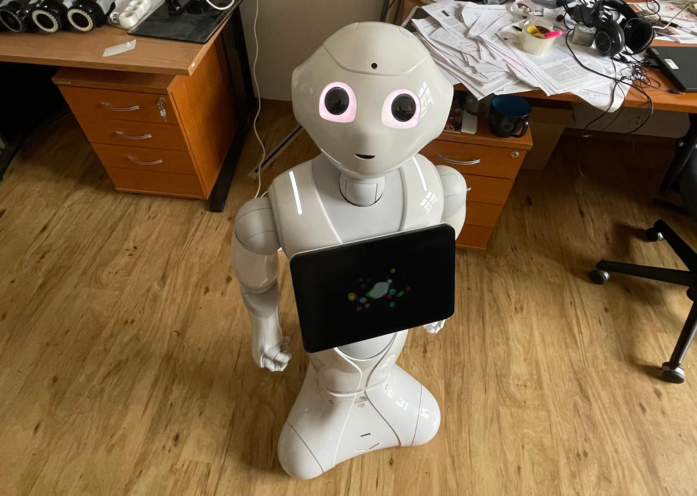

# Pepper — LLM-Driven Receptionist Robot



**Design of an LLM-Driven Receptionist Robot for Social Interaction**

Master's thesis project at CTU FEE Prague. Pepper conducts fluent spoken dialogue with visitors, answers questions about the faculty using RAG over internal documents, and accompanies speech with gestures and animations.

| | |
|---|---|
| **Author** | Bc. Lukas Navara |
| **Supervisor** | doc. Mgr. Matej Hoffmann, Ph.D. |
| **Department** | Dept. of Cybernetics, FEL CVUT |
| **Platform** | Raspberry Pi 5 + SoftBank Pepper |

---

## Architecture

```
+============================== RPi (192.168.210.78) ==============================+
|                                                                                  |
|  User (browser / RPi mic)                                                        |
|         |                                                                        |
|         | WebRTC                                                                 |
|         v                                                                        |
|  +-- LiveKit Server (:7880) -------+                                             |
|  |                                 |                                             |
|  |   +--- pepper-openai --------+  |   ws://host.docker.internal:7880            |
|  |   | OpenAI Realtime API      |  |   (local Docker network — no tunnel)        |
|  |   | gpt-realtime-mini        |  |                                             |
|  |   +-----+-------------------++  |                                             |
|  |         |                       |                                             |
|  +---------+-----------------------+                                             |
|            |                                                                     |
|            | tool calls                                                          |
|            v                                                                     |
|  +---------+---+  +------------------+  +-----------+                            |
|  |  Weaviate   |  | Session Manager  |  |  Bridge   |     +----------+           |
|  |  (RAG)      |  | (:8787)          |  | (:5000)   |     |  Pepper  |           |
|  |  :8080      |  | dispatches agent |  | qi + HTTP +---->|  robot   |           |
|  +-------------+  | by mode          |  +-----------+     |  :9559   |           |
|                    +------------------+                    +----------+           |
|                                                                                  |
|  reverse-tunnel (autossh) ----+                                                  |
|                               |                                                  |
+===============================|==================================================+
                                |
                                | SSH tunnel (RPi --> woska via ptak)
                                | forwards :7880, :7443, :8787, :5000, :8080
                                |
+============================== | ====== GPU server (woska) =======================+
|                               v                                                  |
|  +--- pepper-local --------+      +--- vLLM ----------------------+              |
|  | Faster Whisper STT      |      | Qwen 2.5 7B                  |              |
|  | Piper TTS               |      | :8000                        |              |
|  +-----------+-------------+      +-------------------------------+              |
|              |                                                                   |
|              | ws://127.0.0.1:7880 (via tunnel)                                  |
|              | connects to LiveKit on RPi                                        |
|              +--------> (LiveKit on RPi, through SSH tunnel)                     |
|                                                                                  |
+=================================================================================+
```

**Two voice agents**, each registered with LiveKit under a unique name:

| Agent | Runs on | Connects to LiveKit via | Backend | Use case |
|-------|---------|------------------------|---------|----------|
| `pepper-openai` | RPi (Docker) | `ws://host.docker.internal:7880` (local) | OpenAI Realtime API | Default — low latency, no tunnel needed |
| `pepper-local` | GPU server (tmux) | `ws://127.0.0.1:7880` (SSH tunnel) | Whisper + Qwen 2.5 7B (vLLM) + Piper | Offline-capable, research comparison |

The **session manager** dispatches to the correct agent based on the selected mode. Both agents share a unified tool set: `query_search` (RAG + room directions) and `play_animation` (Pepper gestures).

---

## Quick Start

### Prerequisites

- Raspberry Pi 5 (8 GB) with Docker installed
- `.env` file in project root with `OPENAI_API_KEY` and `LIVEKIT_KEYS`
- Pepper robot on the same network (or reachable via TCP)

### Start

```bash
# All RPi services (includes OpenAI voice agent):
docker compose -f docker/docker-compose.yml up -d

# With RPi microphone:
docker compose -f docker/docker-compose.yml --profile audio up -d

# With GPU server for local mode:
docker compose -f docker/docker-compose.yml --profile audio --profile remote-agent up -d
```

### Operator Panel

Open `http://<rpi-ip>:8787` to monitor sessions, switch agent mode, view transcripts, and control Pepper.

### Switch Mode

```bash
# Switch to local LLM:
curl -X POST http://localhost:8787/api/control/agent-mode \
  -H 'Content-Type: application/json' -d '{"mode":"local"}'

# Switch back to OpenAI:
curl -X POST http://localhost:8787/api/control/agent-mode \
  -H 'Content-Type: application/json' -d '{"mode":"openai"}'
```

---

## Services

| Service | Description | Port |
|---------|-------------|------|
| `livekit` | WebRTC signaling + TURN relay | 7880, 7443 |
| `voice-agent` | OpenAI mode agent (`pepper-openai`) | — |
| `session-manager` | Orchestration, operator panel, agent dispatch | 8787 |
| `bridge` | Pepper control — animations, tablet, audio playback via qi | 5000 |
| `audio-bridge` | Captures agent audio from LiveKit, forwards PCM to bridge | — |
| `room-monitor` | Monitors LiveKit room state, forwards transcripts | — |
| `safe-startup` | Watchdog — waits for Pepper to be reachable | — |
| `weaviate` | Vector DB for RAG (FEE documents) | 8080 |
| `redis` | LiveKit backend | 6379 |
| `user-client` | RPi microphone input (profile: `audio`) | — |
| `reverse-tunnel` | SSH tunnel to GPU server (profile: `remote-agent`) | — |

---

## Project Structure

```
voice-agent/
  src/
    agent.py          # Main entry point — LiveKit agent, warm dispatch, session loop
    config.py          # All configuration, system prompts, animation groups
    tools.py           # query_search + play_animation tool definitions
    local_speech.py    # Faster Whisper STT + Piper TTS for local mode
    utils.py           # Weaviate connection, hybrid search
  data/FEL/            # RAG source documents (FEE statutes, codes)
  models/piper/        # Piper TTS ONNX model

robot/
  src/bridge.py        # Pepper HTTP bridge (animations, tablet, audio)
  utils/               # safe_startup_watchdog, discovery

services/
  src/
    session_manager/   # Session lifecycle, agent dispatch, operator panel
    audio_bridge.py    # LiveKit audio → TCP PCM
    room_monitor.py    # Room state monitoring
    user_client.py     # RPi mic → LiveKit

docker/
  docker-compose.yml   # All service definitions
  docker-compose.rpi.yml  # Override for running local agent on RPi
  Dockerfile.runtime   # Shared Python 3.12 + uv base image
  livekit/             # LiveKit config + TURN certs
```

---

## Documentation

See [PROJECT.md](PROJECT.md) for the full project overview, component details, and thesis checklist.

| Topic | Doc |
|-------|-----|
| Running / deploying | [docs/notes/running.md](docs/notes/running.md) |
| GPU server setup | [docs/notes/gpu-setup.md](docs/notes/gpu-setup.md) |
| Local LLM (vLLM) | [docs/notes/local-llm-setup.md](docs/notes/local-llm-setup.md) |
| RPi dev differences | [docs/notes/rpi-dev.md](docs/notes/rpi-dev.md) |
| Tool-calling investigation | [docs/notes/tools-issue.md](docs/notes/tools-issue.md) |
| Debugging notes | [docs/notes/](docs/notes/) |

---

## Tech Stack

| Layer | Technology |
|-------|-----------|
| WebRTC / Rooms | [LiveKit](https://livekit.io) + LiveKit Agents SDK |
| LLM (cloud) | OpenAI Realtime API (`gpt-realtime-mini`) |
| LLM (local) | [vLLM](https://github.com/vllm-project/vllm) + Qwen 2.5 7B |
| STT (local) | [Faster Whisper](https://github.com/SYSTRAN/faster-whisper) |
| TTS (local) | [Piper](https://github.com/rhasspy/piper) |
| RAG | [Weaviate](https://weaviate.io) + OpenAI embeddings |
| Robot SDK | libqi / NAOqi (SoftBank Pepper) |
| Deployment | Docker Compose on Raspberry Pi 5 |
| Language | Python 3.12 |
